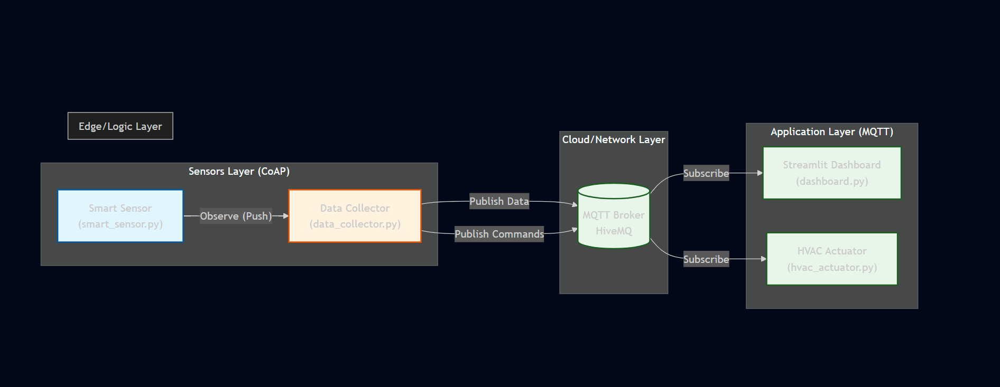

# 🏥 Smart Health Monitor - IoT Infectious Disease Ward

> **Intelligent IoT Project - A.A. 2024/2025**
> Un sistema di monitoraggio ibrido (CoAP + MQTT) per la gestione automatizzata dei parametri vitali e ambientali in reparti ospedalieri critici.

---

## 📸 Architettura del Sistema

Il sistema utilizza un'architettura a livelli che integra sensori *constrained* (vincolati) e attuatori tramite un nodo centrale di elaborazione (Edge Logic).


*(Schema logico del flusso dati: Sensore -> Collector -> Broker -> Dashboard/Attuatore)*

---

## 📝 Descrizione dello Scenario

Il progetto simula una **Smart Room** in un reparto di malattie infettive. L'obiettivo è monitorare costantemente i parametri vitali del paziente (Battito Cardiaco) e intervenire automaticamente sull'ambiente (Sistema HVAC) per garantire condizioni di sicurezza, riducendo l'interazione fisica non necessaria da parte del personale medico.

### Funzionalità Chiave
1.  **Monitoraggio Real-Time:** Lettura continua dei sensori biometrici.
2.  **Automazione (Edge Computing):** Il *Data Collector* analizza i dati localmente e decide autonomamente se attivare la ventilazione o il riscaldamento.
3.  **Digital Twin:** Una dashboard web riflette in tempo reale lo stato fisico della stanza e del paziente.
4.  **Allarmi Intelligenti:** Segnalazione visiva immediata in caso di parametri critici (es. Tachicardia o Ipotermia).

---

## 🛠️ Tech Stack & Protocolli

Il progetto è sviluppato interamente in **Python** e implementa i seguenti standard IoT:

| Componente | Protocollo | Libreria | Ruolo |
| :--- | :--- | :--- | :--- |
| **Smart Sensor** | **CoAP** (UDP) | `aiocoap` | Espone una risorsa *Observable* per il battito cardiaco. |
| **Data Collector** | **CoAP** + **MQTT** | `aiocoap` + `paho-mqtt` | Bridge: Osserva il sensore (CoAP) e pubblica comandi/dati (MQTT). |
| **HVAC Actuator** | **MQTT** (TCP) | `paho-mqtt` | Sottoscrive il topic dei comandi ed esegue azioni. |
| **Dashboard** | **MQTT** (WebSocket) | `streamlit` + `plotly` | Interfaccia grafica per il monitoraggio (Digital Twin). |

---

## 📂 Struttura del Progetto

```bash
📦 smart-health-monitor
 ┣ 📜 smart_sensor.py      # Sensore CoAP (Server) che simula il paziente
 ┣ 📜 data_collector.py    # Logica centrale (CoAP Client + MQTT Publisher)
 ┣ 📜 hvac_actuator.py     # Attuatore MQTT (Client) che simula il condizionatore
 ┣ 📜 dashboard.py         # Dashboard grafica (Streamlit)
 ┣ 📜 ui_assets.py         # Modulo grafico (CSS/HTML Templates)
 ┣ 📜 architecture.png     # Immagine dell'architettura
 ┗ 📜 README.md            # Documentazione

 Certamente! Ecco il file README.md completo e unificato, pronto per essere copiato e incollato. Ho aggiornato la sezione autori con i tuoi dati specifici.Markdown# 🏥 Smart Health Monitor - IoT Infectious Disease Ward

> **Intelligent IoT Project - A.A. 2025/2026**
> Un sistema di monitoraggio ibrido (CoAP + MQTT) per la gestione automatizzata dei parametri vitali e ambientali in reparti ospedalieri critici.

---

## 📸 Architettura del Sistema

Il sistema utilizza un'architettura a livelli che integra sensori *constrained* (vincolati) e attuatori tramite un nodo centrale di elaborazione (Edge Logic).


*(Schema logico del flusso dati: Sensore -> Collector -> Broker -> Dashboard/Attuatore)*

---

## 📝 Descrizione dello Scenario

Il progetto simula una **Smart Room** in un reparto di malattie infettive. L'obiettivo è monitorare costantemente i parametri vitali del paziente (Battito Cardiaco) e intervenire automaticamente sull'ambiente (Sistema HVAC) per garantire condizioni di sicurezza, riducendo l'interazione fisica non necessaria da parte del personale medico.

### Funzionalità Chiave
1.  **Monitoraggio Real-Time:** Lettura continua dei sensori biometrici tramite protocollo leggero (CoAP).
2.  **Automazione (Edge Computing):** Il *Data Collector* analizza i dati localmente e decide autonomamente se attivare la ventilazione o il riscaldamento.
3.  **Digital Twin:** Una dashboard web riflette in tempo reale lo stato fisico della stanza e del paziente tramite MQTT.
4.  **Allarmi Intelligenti:** Segnalazione visiva immediata in caso di parametri critici (es. Tachicardia o Ipotermia).

---

## 🛠️ Tech Stack & Protocolli

Il progetto è sviluppato interamente in **Python** e implementa i seguenti standard IoT:

| Componente | Protocollo | Libreria | Ruolo |
| :--- | :--- | :--- | :--- |
| **Smart Sensor** | **CoAP** (UDP) | `aiocoap` | Espone una risorsa *Observable* per il battito cardiaco. |
| **Data Collector** | **CoAP** + **MQTT** | `aiocoap` + `paho-mqtt` | Bridge: Osserva il sensore (CoAP) e pubblica comandi/dati (MQTT). |
| **HVAC Actuator** | **MQTT** (TCP) | `paho-mqtt` | Sottoscrive il topic dei comandi ed esegue azioni simulate. |
| **Dashboard** | **MQTT** (WebSocket) | `streamlit` + `plotly` | Interfaccia grafica avanzata per il monitoraggio (Digital Twin). |

---

## 📂 Struttura del Progetto

```bash
📦 smart-health-monitor
 ┣ 📜 smart_sensor.py      # Sensore CoAP (Server) che simula il paziente
 ┣ 📜 data_collector.py    # Logica centrale (CoAP Client + MQTT Publisher)
 ┣ 📜 hvac_actuator.py     # Attuatore MQTT (Client) che simula il condizionatore
 ┣ 📜 dashboard.py         # Dashboard grafica (Streamlit) - Entry point UI
 ┣ 📜 ui_assets.py         # Modulo grafico (CSS/HTML Templates) separato
 ┣ 📜 architecture.png     # Immagine dell'architettura
 ┣ 📜 requirements.txt     # Lista delle dipendenze
 ┗ 📜 README.md            # Questo file di documentazione

🚀 Installazione e Setup
1. Prerequisiti
Assicurarsi di avere installato Python 3.10 o superiore.

2. Installazione Librerie
Puoi installare tutte le dipendenze necessarie manualmente eseguendo questo comando nel terminale:

pip install aiocoap paho-mqtt streamlit pandas plotly

▶️ Guida all'Esecuzione (Demo Sequence)
Per avviare la simulazione completa, è necessario aprire 4 terminali separati ed eseguire gli script nel seguente ordine specifico:

1️⃣ Terminale 1: Il Sensore (Paziente)
Avvia il server CoAP che genera i dati biometrici simulati.

python smart_sensor.py

Output atteso: [SENSORE] Smart Bedside Monitor avviato su coap://127.0.0.1...

2️⃣ Terminale 2: L'Attuatore (HVAC)
Avvia il sistema di condizionamento che attende comandi MQTT.

python hvac_actuator.py

Output atteso: [ATTUATORE] Connesso al Broker...

3️⃣ Terminale 3: Il Data Collector (Logic Unit)
Avvia il "cervello" del sistema che collega sensore e attuatore.

python data_collector.py

Output atteso: [COLLECTOR] Connesso al Broker MQTT e ricezione dati in tempo reale.

4️⃣ Terminale 4: La Dashboard (Digital Twin)
Avvia l'interfaccia grafica web.

streamlit run dashboard.py

Il browser di sistema si aprirà automaticamente all'indirizzo http://localhost:8501

🧪 Simulazione ScenariDurante la demo, il sistema reagirà automaticamente ai dati generati casualmente dal sensore

👥 Autori
Progetto realizzato per il corso di Intelligent Internet of Things.

Studente: Daniele Primavera

Matricola: 188567

Anno Accademico: 2025/2026